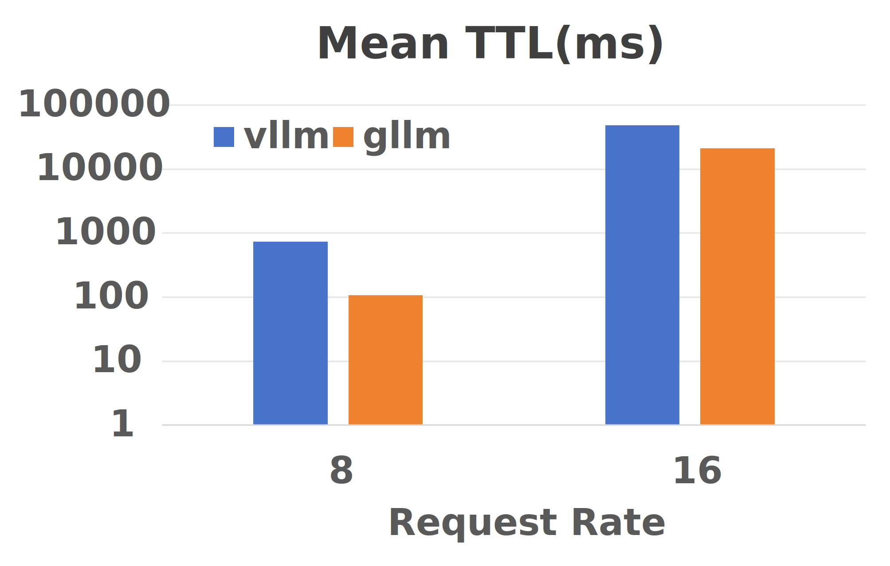
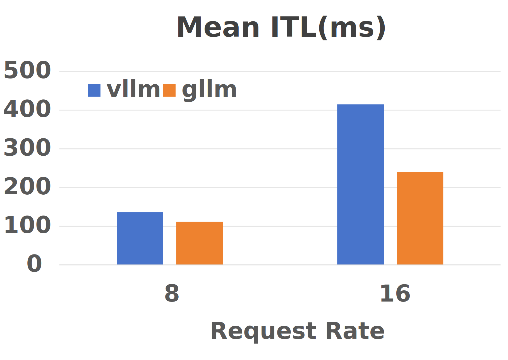

# gLLM
Lightweight, easy, fast and cheap LLM serving

---

## What is gLLM?

Integreted with features like **continuous batching** and **paged attention**, gLLM provides basic functionality (offline/online inference and interactive chat) to support large language model inference. Adopting part of codebase from vLLM, gLLM provides **faster** offline/online inference speed than vLLM with **lightweight** overhead and **minimal** code base. You can also see gLLM as a LLM inference playground for doing experiment or academic research.

### Offline performance (Test on llama3-8b)


### Online performance (Test on llama3-8b #prompts 2048)





### Install gLLM
```
pip install --verbose -e .
```

### Chat mode
```
python examples/chat.py --model-path $MODEL_PATH
```

### Offline batch inference
```
python examples/batch_inference.py --model-path $MODEL \
    --share-gpt-path $SHARE_GPT_PATH --num-prompt $NUM_PROMPT \
    --gpu-memory-utilization $GPU_MEMORY_UTILIZATION
```

### Offline benchmark with gllm/vllm
```
# replace $BACKEND with gllm or vllm
python benchmarks/benchmark_throughput.py --model $MODEL \
    --dataset $DATASET --num-prompt $NUM_PROMPT --backend $BACKEND \
    --trust-remote-code --gpu-memory-utilization $GPU_MEMORY_UTILIZATION
```

### Launch online serving
```
python -m gllm.entrypoints.api_server --port $PORT --model-path $MODEL_PATH
```

### Client Completions
```
python examples/client.py
```

### Client Chat Completions
```
python examples/chat_client.py
```

### Online benchmark with gllm or vllm
```
python benchmarks/benchmark_serving.py --backend $BACKEND --model $MODEL \
        --dataset-name $DATASET_NAME --dataset-path $DATASET_PATH \
        --num-prompts $NUM_PROMPTS --port $PORT --trust-remote-code \
        --request-rate $REQUEST_RATE
```

## Supported Models
> Note that gLLM only support load model from local memory

- llama2-7b and llama3-8b
- chatglm3-6b and glm4-9b
- qwen2-7b

## Limited functionality

- Do NOT support TP or PP
- Limited number of supported models
