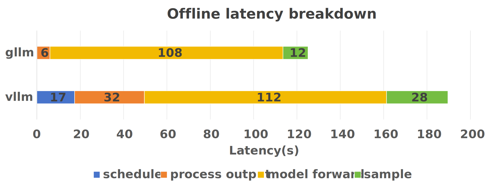

# gLLM
Lightweight, easy, fast and cheap LLM serving

---

## What is gLLM?

Integreted with features like continuous batching and paged attention, gLLM provides minimal functionality (offline inference and interactive chat) to support large language model inference. You can see gLLM as a LLM inference playground for doing experiment or academic research with it. gLLM adopts part of codebase from vLLM and provides faster offline inference speed than vLLM. 

> Test on llama3-8b




Install gLLM
```
pip install --verbose -e .
```

Chat mode
```
python examples/chat.py --model-path $MODEL_PATH
```

Offline batch inference
```
python examples/batch_inference.py --model-path $MODEL
    --share-gpt-path $SHARE_GPT_PATH --num-prompt $NUM_PROMPT
    --gpu-memory-utilization $GPU_MEMORY_UTILIZATION
```

Benchmark with gllm/vllm
```
# replace $BACKEND with gllm or vllm
python benchmarks/benchmark_throughput.py --model $MODEL --dataset $DATASET --num-prompt $NUM_PROMPT --backend $BACKEND --trust-remote-code --gpu-memory-utilization $GPU_MEMORY_UTILIZATION
```

## Supported Models

- llama2-7b and llama3-8b
- chatglm3-6b and glm4-9b
- qwen2-7b

## Limited functionality

- Do NOT support TP or PP
- Do NOT support online serving
- Limited number of supported models
